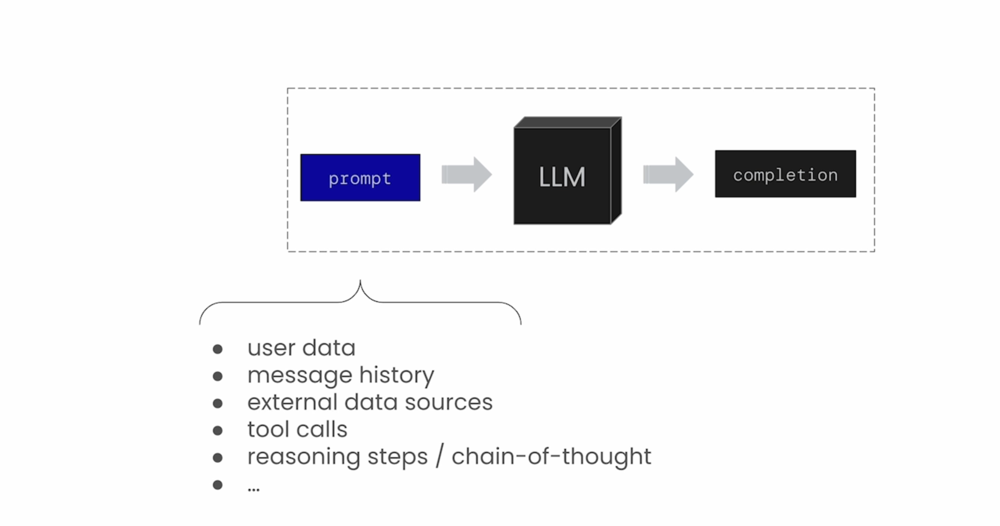
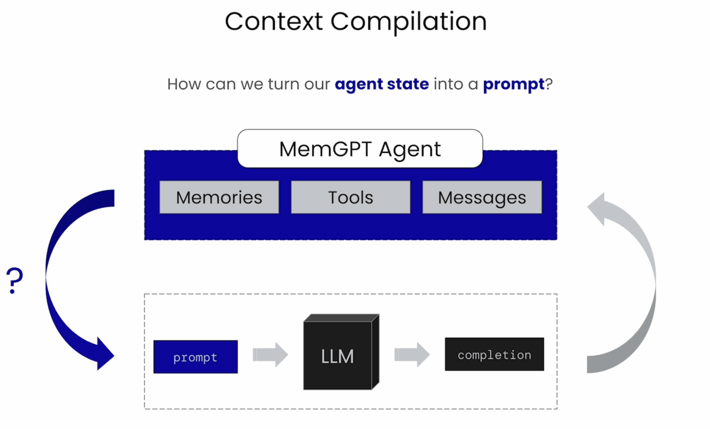

## memgpt:

Even though the current LLM's do have relatively large context window in order to create the RAG systems that can pass the historical contextual information from the user with the techniques presented below.

But these techniques do have issues regarding the following aspects:
1. Upgrading the current contect of the information.
2. Horizontal scalablity: trying to build scalable RAG's without better memory inbuild into agent is not feasible for millions of users.

Concepts:
- self editing memory
- inner thoughts
- every output is the tool
- looping in multiple steps (heartbeat request).

in order to make them autonomous (or semi autonomous in terms of getting the feedbacks) and self improving. 

- edit from the long term policy in order to self improving. 

Context compilation (in order to create the current state of the user discussion as the efficient prompt).

here the context is compiled with the system prompt along with the combination of either the whole chat history being queried from CRUD DB (or creating the context cache like redis with pointers).

###  1.  Constitutents of the agent: 

1. Core / archieval memory: this is the hierarchial L1/L2 memory storage that stores the actual description. these are divided into 2 parts (in context and out of context).

2. Prompt storage: This stores the core LM prompt (that is usually constant but can be adapted in order to finetune the response or to avoid the edge cases to avoid the generation of the hallucination) details.

3. A/R stats: these are the statistics about the external memory.

### Breaking the context window:

1. Given that context window is constant and the agent context window increases with the complexity of O(messages) thus we need to resolved with the following techniques:
        - Evict the message if it surpases the LM's finite context window. this can be done by creating an identifier to check the messages that dont have the relevance (i.e those queries that are answered in entirity).
            - NOTE: **This is not the caracterstic in the original Memgpt paper** but still included because in the actual commercial applications that need to be compliant with the GDPR or other privacy regulations. 
        - Creation of the cache (or the recall memory in LM's memory management) that stores the checkpoint summary of the several messages (or stores the encoded vector information).
        - This is done by another agent that implements another LM inference job of either the sliding window (i.e passing the chat history with the system prompt that askss the LM to get the suùmmarized storage (being succinct) and then stores it to the fast accessible cache).
        - Or to create the self modifying maps / bloom filters (langgraph) and use the graph query to measure wheter certain message during the course of time are not much relatable

        - and the older messages stored in long term storages (object , S3 or the vector DB's) can then be fetched if the recall memory doesnt get the output.

