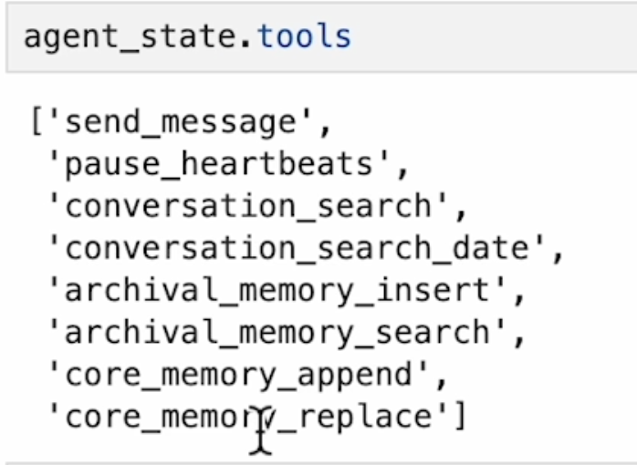

## designing memory agents procedure:

-> by controlling the following knobs:
    - prompts (describing the system persona and the potential output result), 
    - agent tools 
    - algorithms for management of the agent tools and the memory execution. 
    - agent memory content (core and archival).

-> generates the response as the function call statistics and the internal monologue (that showcases the observability of the given model).

-> understanding the agent state:->
    - system prompt (defined by the client.create_agent(...).system) is the predefined by the letta team for explaining the azgent the nuanaces of how to manage the memory and then create the context from the different memory (either from recall or the secondary memory) along with the .
    - **TODO: you need to also refine the system prompt of this agent based on the evolution in the jobs**  
    - tools for the management of the agent memory:

</img>

    - agent memory: 

    - gettinhg archival_state_memory

    - and getting the core message of the user

    - core-memory_replace: replaces the previous memory contnt with the current one :
        - i think this should be versioned controlled rather than having it as the destructive version.
    
    - 